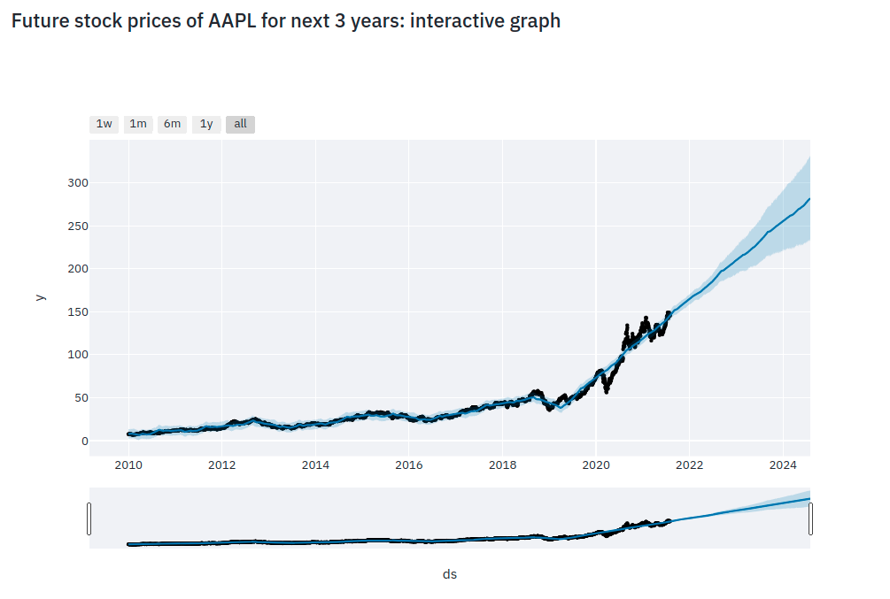

# Heroku stock predictor app
> see your stock performance upto 5 years ahead of time





---

### Table of Contents

- [Description](#description)
- [Data](#data)
- [How To Use](#how-to-use)
- [References](#references)
- [Author Info](#author-info)
---
## Description
This stock predictor app uses facebook's [prophet](https://facebook.github.io/prophet/) model for predicting stock prices. You can specify on how many years ahead you want to see the trends. Moreover, you can also see the yearly and weekly trend for a stock of your choice.

#### Technologies
- yahoo_fin.stock_info
- yfinance
- prophet
- plotly 
- streamlit

---
## Data
The stock data is taken from [finance.yahoo.com](https://finance.yahoo.com/) via their API. This includes DOW, SP500 and NASDAQ stocks


---
## How To Use
#### Installation

clone this repository

```bash
git clone "https://github.com/Hasnat79/Heroku-stock-predictor-app" 
```


open terminal on the same folder.

```ps
pip install -r requirements.txt
```

#### API References

run stock_predictor.py file to run the app

```
streamlit run stock_predictor.py
```


---
## References 
- [Prophet](https://facebook.github.io/prophet/)
- [Predicting Google’s Stock Prices Using Facebook’s Prophet](https://medium.com/mlearning-ai/predicting-googles-stock-prices-using-facebook-s-prophet-4829c83a8590)

[Back To The Top](#heroku-stock-predictor-app)

---
## Author Info

- Twitter - [@hasnat_omi](https://twitter.com/hasnat_omi)
- Email - [hasnatabdullah79@gmail.com](hasnatabdullah79@gmail.com)

[Back To The Top](#heroku-stock-predictor-app)


